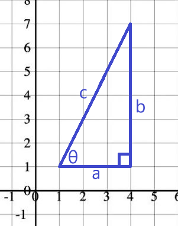

# Table of Contents {-}

<!-- TOC -->

- [Table of Contents {-}](#table-of-contents--)
- [Basics](#basics)
- [Triangles](#triangles)
- [Adding a Vector to a Vector](#adding-a-vector-to-a-vector)
- [Multiply Vector by Scalar](#multiply-vector-by-scalar)
- [Multiply Vector by Vector](#multiply-vector-by-vector)
- [Dot Product](#dot-product)
- [Unit Vectors](#unit-vectors)
- [Appendix: Markdown](#appendix-markdown)
- [Appendix: LaTeX Equations in Markdown](#appendix-latex-equations-in-markdown)
  - [Reals and Sets](#reals-and-sets)
  - [Subscript and Superscript](#subscript-and-superscript)
  - [Equations](#equations)

<!-- /TOC -->

# Basics

$$\reals{^2}$$
2 = 2-dimensional real coordinate space, represented by a 2-tuple.  It is all possible real-valued 2-tuples.
A tuple is as ordered list of numbers.

# Triangles

$$\text{a = horizontal (x)}$$
$$\text{b = vertical (y)}$$
$$\text{c = hypotenuse}$$
$$\theta\text{ = the angle of ac (theta symbol)}$$
$$\sin \theta = \frac{b}{c}$$
$$\cos \theta = \frac{a}{c}$$
$$\tan \theta = \frac{b}{a}$$
$$\csc \theta = \frac{c}{b}\text{ (cosecant)}$$
$$\sec \theta = \frac{c}{a}\text{ (secant)}$$
$$\cot \theta = \frac{a}{b}\text{ (cotangent)}$$

# Adding a Vector to a Vector

Adding vectors is just following one vector then the next and so on until you get to the end.

$$\vec{a} = \begin{bmatrix}6\\
-2
\end{bmatrix}$$

$$\vec{b} = \begin{bmatrix}-4\\
4
\end{bmatrix}$$

$$\vec{a}, \vec{b} \in \reals{^2}$$

$$\vec{a} + \vec{b} = \begin{bmatrix}2\\
2
\end{bmatrix}$$

# Multiply Vector by Scalar

Multiplying a vector by a positive scalar changes its magnitude, but not its direction.
Multiplying a vector by a negative scalar changes its magnitude, and reverses its direction.

$$\vec{a} = \begin{bmatrix}2\\1\end{bmatrix}$$

$$3\vec{a} = 3\begin{bmatrix}2\\1\end{bmatrix} = \begin{bmatrix}6\\3\end{bmatrix}$$

# Multiply Vector by Vector

Take vectors of equal dimensionality, multiply each dimension.

$$\vec{a}\vec{b} = a_1b_1 \cdots a_nb_n $$

# Dot Product

Take vectors of equal dimensionality, multiply each dimension, then add all of the results.

$$\vec{a} \cdot \vec{b} = \sum_{i=1}^{n} a_ib_i = a_1b_1 + a_2b_2 + \cdots + a_nb_n $$

# Unit Vectors

A unit vector has a magnitude (or length) of 1.

$$\vec{v} = \begin{bmatrix}2\\3\end{bmatrix} = (2, 3)$$

$$\text{"i hat"} = \hat{i} = \begin{bmatrix}1\\0\end{bmatrix}$$

$$\text{"j hat"} = \hat{j} = \begin{bmatrix}0\\1\end{bmatrix}$$

$$\vec{v} = 2\hat{i} + 3\hat{j}$$

In three dimensions, you use i, j, k.

Dividing a vector by its magnitude will find a vector in the same direction as the vector, but with a magnitude of 1:

$$\text{Unit vector in the direction of }\vec{v} = \frac{\vec{v}}{||\vec{v}||} = \frac{(6,3)}{\sqrt{6^2 + 3^2}} = \frac{1}{\sqrt{45}} \cdot (6,3) = (\frac{6}{\sqrt{45}}, \frac{3}{\sqrt{45}})$$

# Appendix: Markdown

> This is a blockquote
>
> --- Name

# Appendix: LaTeX Equations in Markdown

## Reals and Sets

$$\reals$$
$$\in$$
$$\sub$$
$$\subset$$
$$\Subset$$

## Subscript and Superscript

$$\reals{_2}$$
$$\reals{^2}$$

## Equations

$$f(k) = {n \choose k} p^{k} (1-p)^{n-k}$$

$$\begin{array}{ccc}
x_{11} & x_{12} & x_{13}\\
x_{21} & x_{22} & x_{23}
\end{array}$$

$$X = \begin{bmatrix}1 & x_{1}\\
1 & x_{2}\\
1 & x_{3}
\end{bmatrix}$$

$$\Theta = \begin{pmatrix}\alpha & \beta\\
\gamma & \delta
\end{pmatrix}$$

$$\begin{vmatrix}a & b\\
c & d
\end{vmatrix}=ad-bc$$

